<h1 align="center">Spacefruit 🪐</h1>

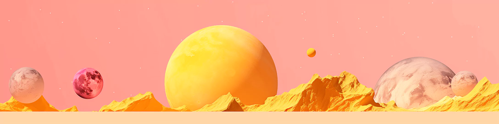

<h3 align="center"><a href="https://shanedoyledev.github.io/spacefruit">➡️ View the live project here ⬅️</a></h3>

 

## Introduction

Welcome to Spacefruit, the extraordinary (fictional) creative agency that brings your wildest branding, design, and animation dreams to life! My purpose in designing this website is to make a lasting positive impression on visitors and establish trust with them, in order to attract new potential clients to the business. The website is designed as a Single Landing page, allowing the viewer to progress through the content in an uninterrupted flow and enabling the story of the brand to unfold.

While researching other creative agencies, I noticed they place a high emphasis on the aesthetic appeal of their websites to catch the attention of new clients. Therefore, I chose to create a project centering around a fictional creative agency of my own imagination. This decision allowed me to challenge myself in creating a bold, striking, and cohesive visual design, providing what I believe is an excellent showcase of my frontend web development skills.

<h3 align="center">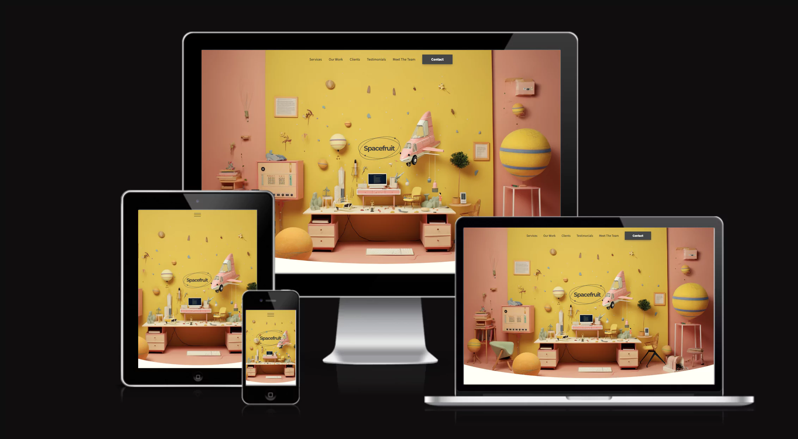</h3>

## Table of Contents

- [User Experience (UX)](#user-experience-ux)
  - [User Stories](#user-stories)
- [Design](#design)
  - [Colour Scheme](#colour-scheme)
  - [Typography](#typography)
  - [Components](#components)
  - [Imagery](#imagery)
  - [Wireframes](#wireframes)
- [Features](#features)
  - [Existing Features](#existing-features)
  - [Future Implementations](#future-implementations)
  - [Accessibility](#accessibility)
- [Technologies](#technologies)
  - [Programming Languages](#programming-languages)
  - [Applications, Plugins & Tools Used](#applications-plugins--tools-used)
- [Deployment & Local Development](#deployment--local-development)
  - [Deployment](#deployment)
  - [Local Development](#local-development)
- [Testing](#testing)
  - [Automated Testing](#automated-testing)
  - [Manual Testing](#manual-testing)
  - [Bugs](#bugs)
- [Credits](#credits)
  - [Code Used And Tutorials](#code-used-and-tutorials)
  - [Content](#content)
  - [Media](#media)
  - [Acknowledgments](#acknowledgments)

## User Experience (UX)

- ### User stories

  - #### User Goals

    The term "user" refers to individuals, potentially including prospective clients, who could be exploring the website for their first time.

    1. As a user, I want to easily understand the services offered by the agency.
    2. As a user, I want to navigate easily and find the content I'm looking for regardless of where I am on the page.
    3. As a user, I want to see compelling examples of any previous campaigns the agency has worked on.
    4. As a user, I want to determine if the agency has collaborated with any notable brands before.
    5. As a user, I want to find client testimonials to gain insights into what their users think of them and assess their level of trustworthiness.
    6. As a user, I want to have a user-friendly way to message the agency and find their contact details, along with any social media links.

  - #### Company Goals

    The company also has its own objectives and goals associated with the website.

    1. As a company, I want to make a positive impression on any potential clients in an effort to attract new business.
    2. As a company, I want to showcase our best work to prove our capability and skill in delivering to potential clients.
    3. As a company, I want to ensure the content and information presented on the site is relevant to serving the needs of the visitor.
    4. As a company, I want a strong CTA (Call to Action) to establish communication and build relationships with new clients.

## Design

- #### Colour Scheme
  ### 
  I have chosen a nice shade of golden yellow as the primary color of the brand and complemented it with a punchy pink to serve as the accent color. I have also subtly altered the black and white colors from their maximum values, providing a more subtle contrast for a smoother reading experience.
- #### Typography
  ### 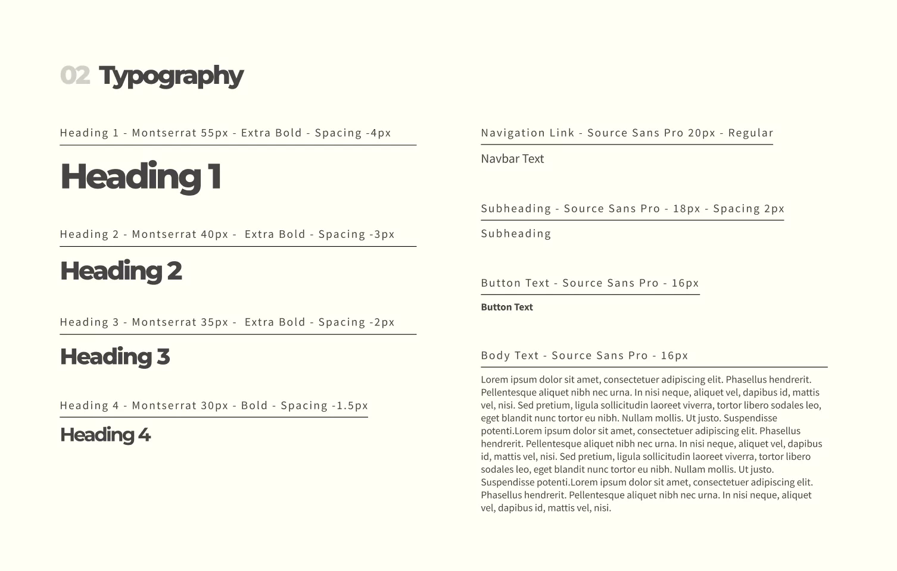
  I've opted for Montserrat as the main font for the website, paired with Source Sans as the body text. This combination works well together, providing a clean and attractive style. In case of any importing issues, the default sans-serif on the users browser serves as a reliable fallback font. The result is a polished and cohesive design that enhances the overall aesthetics and readability of the site.
- #### Components
  ### 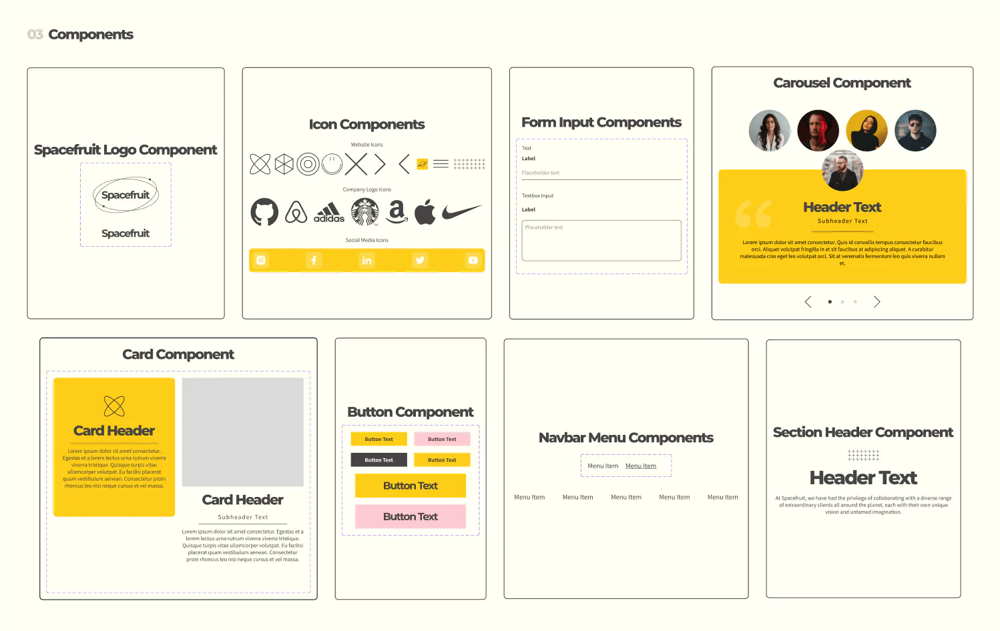
  By adopting a component-centric approach in my UI design, I designed and created reusable UI components that serve multiple purposes. This approach guarantees a consistent and harmonious look and feel across the entire user interface, elevating the overall user experience when navigating my site.
- #### Imagery

  Imagery is crucial to the aesthetic appeal of the design. I aimed to ensure a sense of continuity throughout the entire design by using imagery that adhered to the color palette of the project. My intention was to convey a retro and playful yet professional vibe, making the visuals as eye-catching as possible.

- #### Wireframes

  I created the initial website wireframes in Figma, allowing me to iterate on the design and experiment with imagery, typography, color, and layout. This was all then codified into a design system to ensure consistency in my design elements. Once I was satisfied with the UI/UX design and content placement, I proceeded to the coding stage of the project.

- Desktop Wireframe - [View](https://www.figma.com/file/rzanDrkEQZxJdS61KBg2fq/SpaceFruit?type=design&node-id=327-2084&mode=design&t=9fjEwbyFY9ISU9Gt-0)

- Tablet Wireframe - [View](https://www.figma.com/file/rzanDrkEQZxJdS61KBg2fq/SpaceFruit?type=design&node-id=327-2767&mode=design&t=9fjEwbyFY9ISU9Gt-0)

- Mobile Wireframe - [View](https://www.figma.com/file/rzanDrkEQZxJdS61KBg2fq/SpaceFruit?type=design&node-id=327-2768&mode=design&t=9fjEwbyFY9ISU9Gt-0)

- Design System - [View](https://www.figma.com/file/rzanDrkEQZxJdS61KBg2fq/SpaceFruit?type=design&node-id=42-76&mode=design&t=9fjEwbyFY9ISU9Gt-0)

## Features

### Existing Features

<h3 align="center"> Navigation Bar</h3>

### 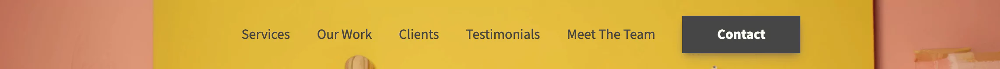

- The navigation bar features links that enable users to smoothly scroll to any of the main page sections.

- At the top of the page, the navbar maintains a transparent background in order to avoid interfering with the visuals of the hero image, while still remaining clearly visible.

### 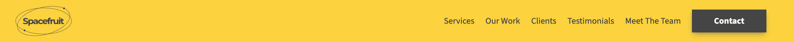

- As the user scrolls past the hero section of the page, the navbar becomes sticky and affixes to the top of the viewport. It changes to the primary background color to distinguish it from the page's content.

- A fixed navigation bar allows users to navigate through the page seamlessly, regardless of their position on the website. This is particularly crucial for single-page apps with considerable vertical dimensions, as it helps minimize unnecessary scrolling.

### 

- On smaller screen widths, the navbar menu collapses into a single hamburger icon. This approach prevents the links from becoming too crowded together.

### 
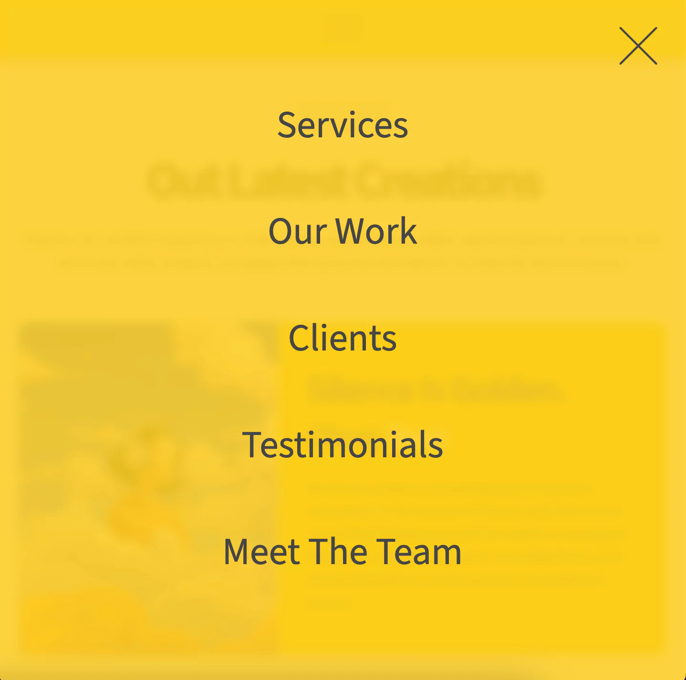

- Clicking the hamburger icon for the mobile version of the navbar reveals an overlay menu. This design provides more space between the links, allowing users to easily click on each link to be directed to the corresponding section of the page.

---

 

<h3 align="center">Hero Section</h3>

### 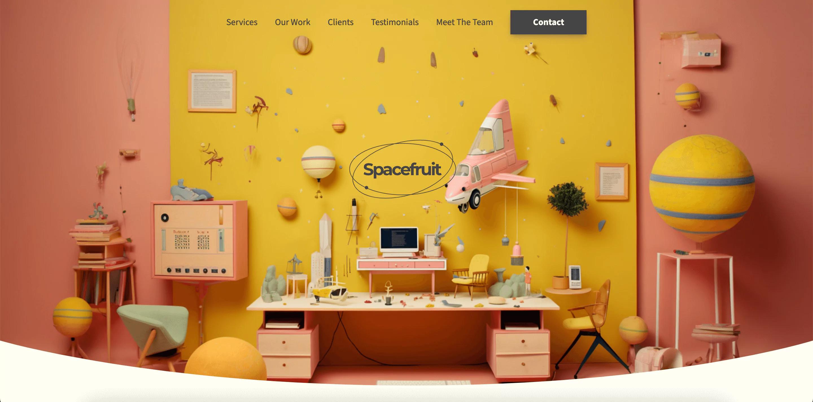

- The Hero Section of a website occupies the full width of the screen and is located at the top of the page, above the fold (i.e., the portion of the webpage visible without scrolling). Given its prime location, I wanted it to capture the visitor's attention and prompt them to engage further with the content or offerings of the website.

- I also ensured to position the imagery in a way that would look good across a range of different devices, from desktops to mobiles.

 

---

 

<h3 align="center">Services Section</h3>

### 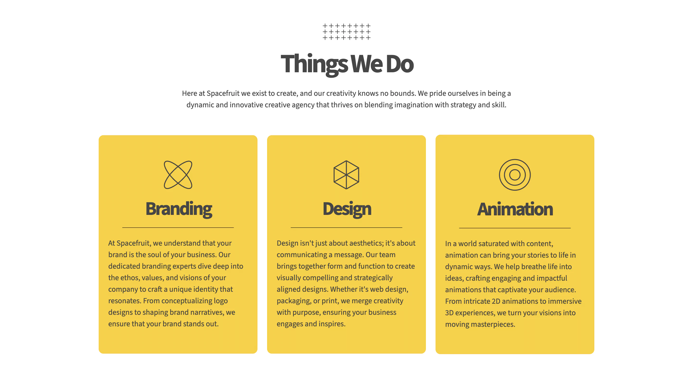

- The Services Section distinctly highlights each offering of the agency. Every service is presented in its own card, ensuring clarity. To ensure responsiveness, the cards adjust into columns as the viewport narrows.

 

---

 

<h3 align="center">Portfolio Section</h3>

### 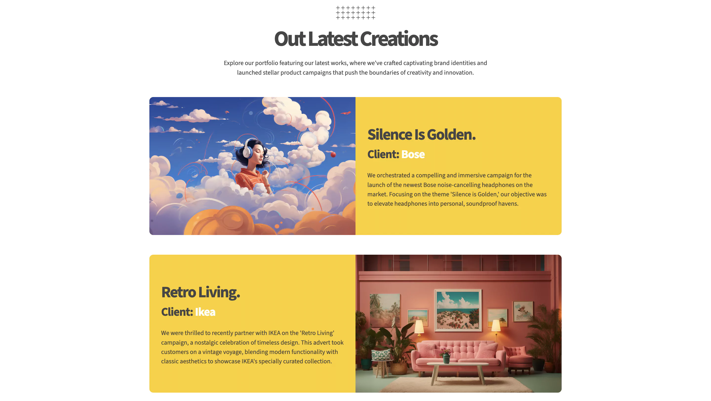

- The Portfolio Section showcases the company's recent campaigns. Each entry features a visual, accompanied by a summary describing the campaign's focus.

### 
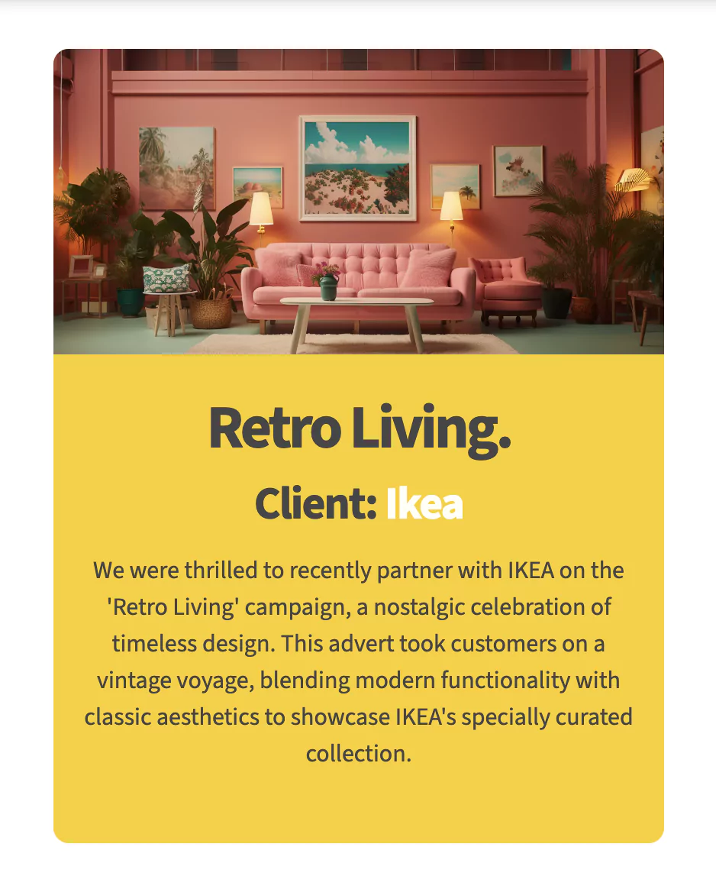

- Each card adapts to position the image above the text, ensuring a pleasant and readable experience on smaller mobile devices.

 

---

 

<h3 align="center">Clients Section</h3>

### 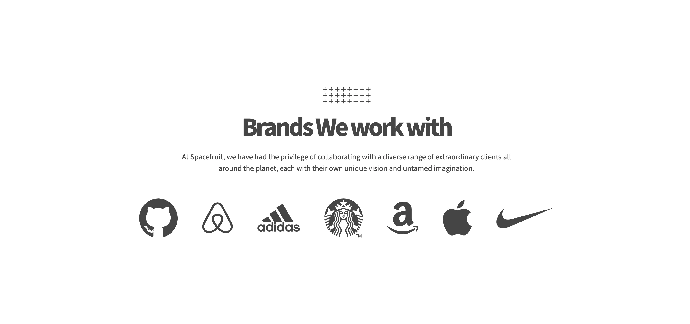

- The Clients Section showcases the agency's collaboration with recognizable and reputable companies, thereby bolstering its credibility and instilling confidence in potential clients. Since logos are inherently recognizable, additional text is minimized to ensure a clean design.

 

---

 

### <h3 align="center">Testimonials Section</h3>

### 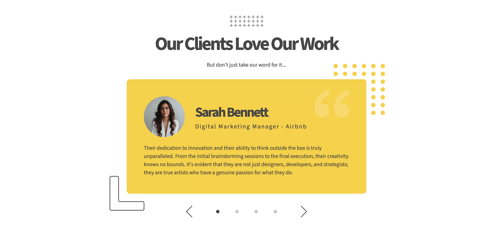

- Similar to the Clients Section, the Testimonials Section is designed to bolster trust in the agency. I implemented interactivity in this section using JavaScript, enabling users to cycle through testimonials via pagination controls at the bottom. I believe this approach offers a more streamlined and efficient way to present the information.

 

---

 

<h3 align="center">Team Section</h3>

### 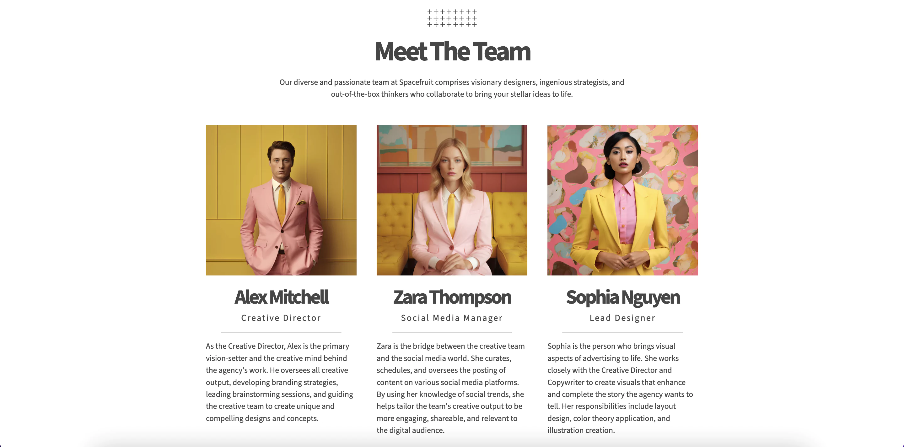

- The team section is arranged in a 3x3 grid format on larger screens, collapsing to accommodate smaller ones. Each team member is featured in a full frontal profile shot, accompanied by a brief description of their role in the company.

 

---

 

<h3 align="center">Call To Action Section</h3>

### 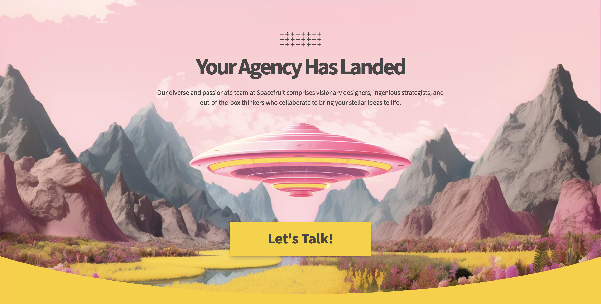

- The Call-To-Action Section includes a full-screen background, echoing the style of the Hero Section, and offers a fitting wrap-up for the website. With eye-catching visuals and a standout CTA button front and center, it encourages users to get in touch after getting a taste of what the agency can do.

 

---

 

<h3 align="center">Footer Section</h3>

### 

- The Footer Section displays the logo, legal information, and a list of links directing users to respective social media pages. I've consolidated all social links in one spot and placed them here, as its conventional to see them in the footer of many other websites.

 

---

 

<h3 align="center">Contact Form Modal</h3>

### 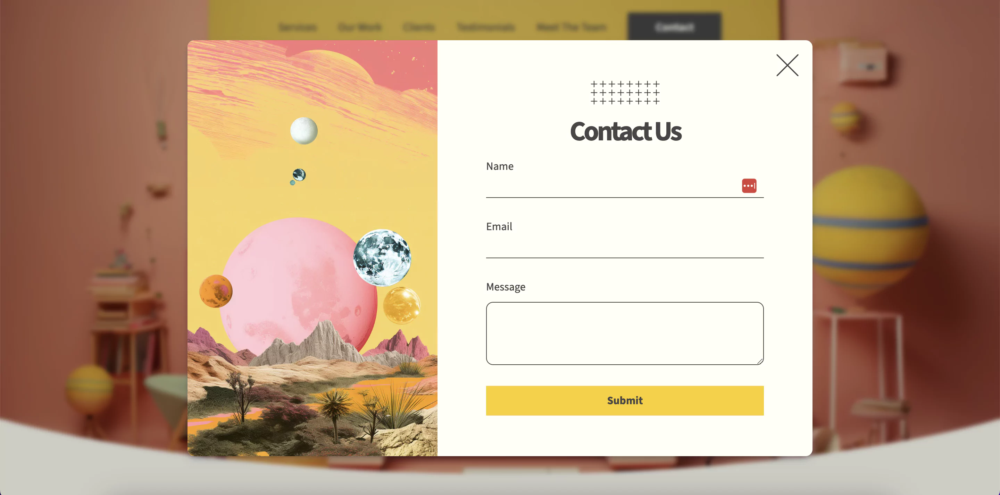

- The Contact Form was implemented inside of a modal component so that it could appear over the main content. This focuses the user's attention solely on the form, reducing distractions from other elements on the page. It also helps save webpage space, leading to a cleaner design.

### 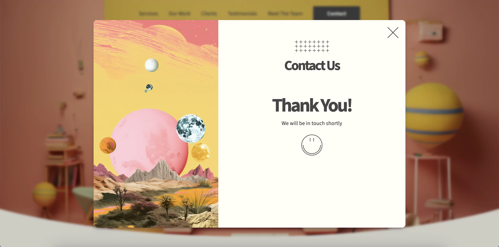

- After submitting the form, it's essential for users to receive immediate feedback. To address this, a subtle welcome animation appears, signaling a successful submission and reassuring them that they'll be contacted soon.

### 
 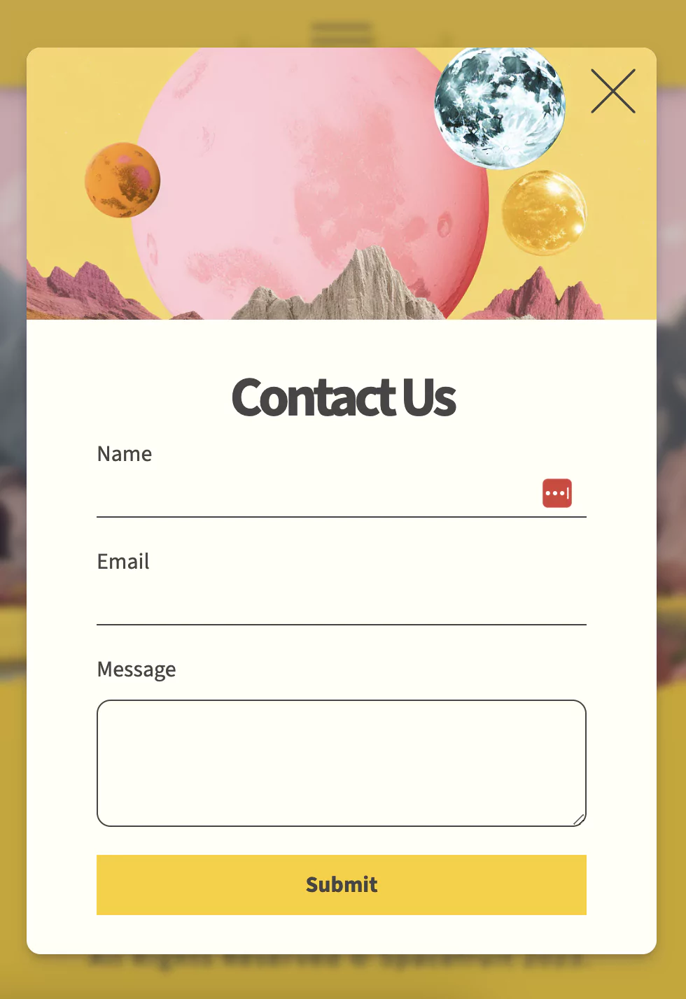

- On mobile devices, placement of the image switches to the top to give the inputs the necessary space, ensuring users can comfortably fill out the form.

---

 

<h3 align="center">404 Page</h3>

### 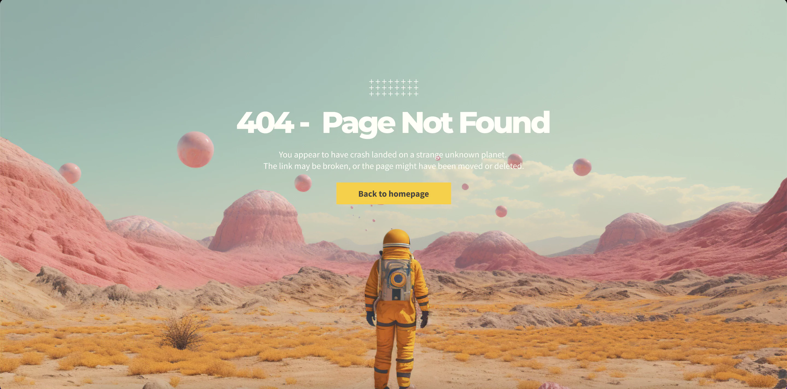

- The 404 Page sports a full-screen background in line with the site's branding, reassuring users they're still on the same website. With a notification that the page is missing and a brief explanation, a button allows them to be redirected back to the homepage for a more seamless user experience.

 

---

 

### Future Implementations

1. **Expanding the website's portfolio section**

   - Offer more detailed insights into each showcased campaign by adding a "Learn More" button at the bottom of each card.
   - Link these buttons to dedicated pages that provide comprehensive information about the campaigns.
   - Incorporate multimedia content, such as videos, photos, and graphics, to provide a richer user experience. This will allow visitors to immerse themselves in the campaigns' stories and details.

    

2. **Dark theme**

   - Implement a dark theme mode for the website that users can toggle.
   - This will be beneficial for users who prefer darker aesthetics or for those browsing at night, reducing eye strain.
   - Ensure that the dark theme maintains the website's overall design coherence and doesn’t affect the user experience negatively.

    

### Accessibility

**Semantic Tags** - The HTML is structured using semantic tags which help give meaning to the content and improve the user experience for those using screen readers.

**Readable Sans-Serif Font** - I chose a sans-serif font for the body text of the site because they are more suitable for people with dyslexia, aiding in content readability.

**Responsive Typography** - I made sure to set my font sizes using REM units, which scale relative to the base font size set by the browser. These units help ensure that users who require larger text for better readability, such as those with visual impairments, can easily adjust the font size without breaking the layout.

**Disable Animations** - I've implemented a CSS code segment using the prefers-reduced-motion media query. This ensures animations are turned off for users who prefer reduced motion, allowing for a more accessible and user-friendly experience, especially for those sensitive to excessive animations.

 

## Technologies

### Programming Languages

- [HTML5](https://en.wikipedia.org/wiki/HTML5)
- [CSS3](https://en.wikipedia.org/wiki/Cascading_Style_Sheets)
- [JavaScript](https://en.wikipedia.org/wiki/JavaScript)

### Applications, Plugins & Tools Used

1. [Visual Studio Code](https://code.visualstudio.com/) - I used Visual Studio Code on my local machine as my preferred IDE for coding the HTML, CSS, and JavaScript. It assisted in the development process of the project and in creating the README file using markdown.

2. [Figma](https://figma.com/) - I employed Figma to craft the high-fidelity UI mockups during the UI/UX design planning phase. It also served to plan the website's design system and to organize UI elements into modular, reusable components. This facilitated a more structured approach to my CSS coding in later stages.

3. [Midjourney](https://www.midjourney.com/) - I utilized Midjourney to generate all the website images. By incorporating specific keywords, I ensured that the images were produced in a consistent art style for a cohesive visual design. With my paid account plan, I have the right to use these generated images for my project, in line with Midjourney's [terms of service](https://docs.midjourney.com/docs/terms-of-service).

4. [Photoshop](https://www.adobe.com/ie/products/photoshop.html) - Photoshop was instrumental in editing and cleaning up images from Midjourney. Furthermore, it enabled the compression and optimization of image file sizes to make them web-friendly, thus enhancing the website's loading performance.

5. [Git](https://git-scm.com/) - I used Git for version control, operating it from the terminal on my local machine. All modifications were pushed to my remote repository on GitHub.

6. [GitHub](https://github.com/) - GitHub hosts my project remotely, making the source code accessible to others. I also use it to deploy my site via GitHub Pages.

7. [Am I Responsive?](https://ui.dev/amiresponsive) - This tool displays the website image across various devices.

8. [Shields.io](https://shields.io/) - I used this to integrate badges into the README.

9. [Google Fonts](https://fonts.google.com/) - Google Fonts was employed to import both 'Montserrat' and 'Source Sans' fonts into the CSS stylesheet.

10. [Thin Glyphs Icon Set](https://www.figma.com/community/file/1003754713433918928) - I incorporated this Figma Icon Set for the website's decorative icons.

11. [Retturoo: Hand Drawn Retro Shapes](https://www.figma.com/community/file/1163470945933586849) - I selected shapes from this Figma collection for the website's decorative elements.

12. [Brandfetch Figma Plugin](https://www.figma.com/community/plugin/733590967040604714/Brandfetch) - This plugin in Figma facilitated the creation of SVG logos for both the brand section of the website and the social media logos in the footer.

13. [User Profile Figma Plugin](https://www.figma.com/community/plugin/749945157855564842/User-Profile) - This plugin in Figma enabled me to generate image profile avatars for each persona in the testimonial section.

14. [Tiny Img](https://tiny-img.com/webp/) - I used this platform to compress my images to a more optimal file size for the web, and also to convert them to the contemporary .webp format.

15. [ChatGPT](https://chat.openai.com/) - This tool played a role in inspiring some of the website's text content and was invaluable in checking for spelling or grammatical inaccuracies in the text. It also offered helpful suggestions for ways I could improve the code I wrote, particularly in the areas of accessibility and coming up with good semantic class names.

 

## Deployment & Local Development

### Deployment

The site is deployed using GitHub Pages - [Spacefruit](https://shanedoyledev.github.io/spacefruit)

To deploy the site using GitHub Pages:

1. Login (or signup) to GitHub.
2. Go to the repository for this project: [ShaneDoyleDev/spacefruit](https://github.com/ShaneDoyleDev/spacefruit)
3. Click the settings button.
4. Select "Pages" in the left-hand navigation menu.
5. From the source dropdown, select the "main" branch and press save.

The site has now been deployed. Please note that this process may take a few minutes before the site goes live.

---

### Local Development

### How to Fork

To fork the repository:

1. Log in (or sign up) to GitHub.
2. Go to the repository for this project: [ShaneDoyleDev/spacefruit](https://github.com/ShaneDoyleDev/spacefruit)
3. Click the "Fork" button in the top right corner.

### How to Clone

To clone the repository:

1. Log in (or sign up) to GitHub.
2. Go to the repository for this project: [ShaneDoyleDev/spacefruit](https://github.com/ShaneDoyleDev/spacefruit)
3. Click on the "Code" button, select whether you would like to clone with HTTPS, SSH, or GitHub CLI, and copy the link shown.
4. Open the terminal in your code editor and change the current working directory to the location you want to use for the cloned directory.
5. Type `git clone` into the terminal and then paste the link you copied in step 3. Press enter.

### Committing and Pushing Changes

After making changes to your local copy, you can commit and push them to GitHub:

1. Open the terminal in the directory of your cloned repository.
2. Use `git status` to see the changes you've made.
3. Use `git add .` to stage all changes for commit, or `git add <filename>` to stage specific files.
4. Use `git commit -m "Your commit message here"` to commit your changes with a descriptive message.
5. Use `git push origin main` to push your changes to the main branch on GitHub.

 

## Testing

### Automated Testing

#### Validator Testing

- #### HTML

  ### 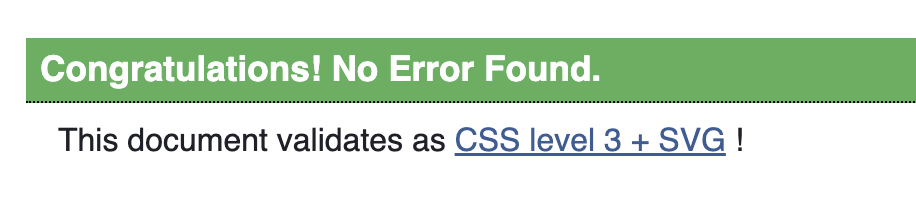

  [W3C Markup Validation Service](https://validator.w3.org/nu/?doc=https%3A%2F%2Fshanedoyledev.github.io%2Fspacefruit%2F) - On initial submission I recieved error messages indicating that 'px' values should not be suffixed to the width and height attributes of images. After removing the 'px' suffixes, the validation passed without any errors.

- #### CSS

  ### 

  [W3C Jigsaw CSS Validation Service](https://jigsaw.w3.org/css-validator/validator?uri=https%3A%2F%2Fshanedoyledev.github.io%2Fspacefruit%2F&profile=css3svg&usermedium=all&warning=1&vextwarning=&lang=en) - No errors were found when passing through the official (Jigsaw) validator.

 

- #### LightHouse

  Lighthouse was used within Chrome Developer Tools to test the performance, accessibility, best practices, and SEO of the website.

  #### Desktop

  This is my initial Lighthouse ranking for the desktop version.

  ### 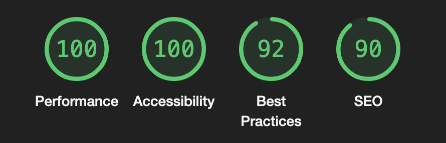

  #### Mobile

  This is my initial Lighthouse ranking for the mobile version.

  ### 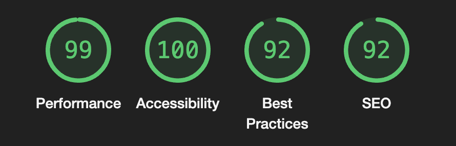

  #### Improvements

  I was satisfied with my performance rating but wanted to investigate further what was causing the lower scores for both the best practices and SEO rating.

  - SEO - Lighthouse informed me that I was missing meta tags in the `<head>` of my HTML document. Therefore, I went ahead and included them. These meta tags included the description and keyword tags, respectively.

  - Best Practices - I received feedback that some of my images did not have a clearly defined width and height. Therefore, I made sure to set them in my CSS stylesheet.

  #### Final Score

  - I was delighted to see that when I addressed these issues, I was able to push my ranking to a perfect score!

### 
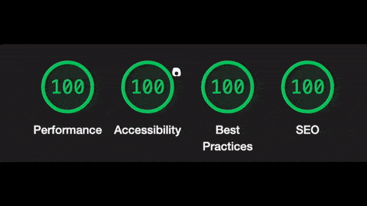

 

- #### Accessibility

  - [Wave](https://wave.webaim.org/report#/https://shanedoyledev.github.io/spacefruit/) - When first analyzing my website with the Wave tool, I encountered no errors. However, there were some aspects highlighted that I have since addressed and detailed below.

    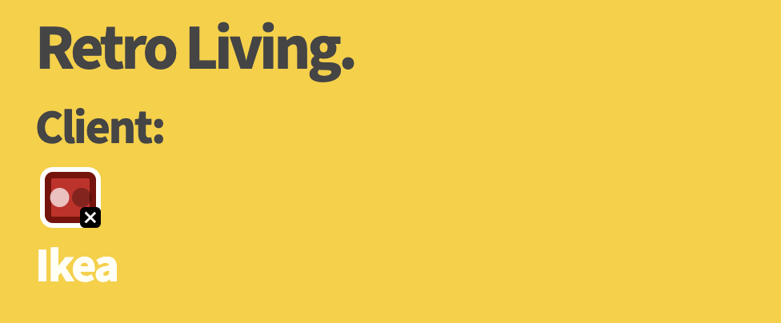

     

  - There was low contrast on the text of three of the subheadings on each of the campaign cards in the portfolio section. I changed the text color from white to black to help them stand out more prominently and improve the contrast for better readability.

    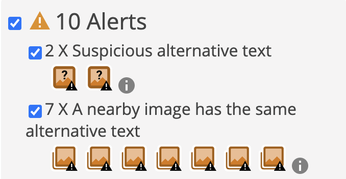

     

  - I was advised to improve the 'alt' descriptions for several images, as repetitive text was used across multiple images in the testimonial and team sections of the website. I've since revised them to be both unique and more descriptive.

  - Wave notified me that the images on my website lacked aria-labels. As these are important for accessibility, I took the initiative to revisit and update the HTML code. By adding these labels, this ensures a more user-friendly experience, especially for those using assistive technologies.

  - Here is the final Wave report after addressing all of these issues.

    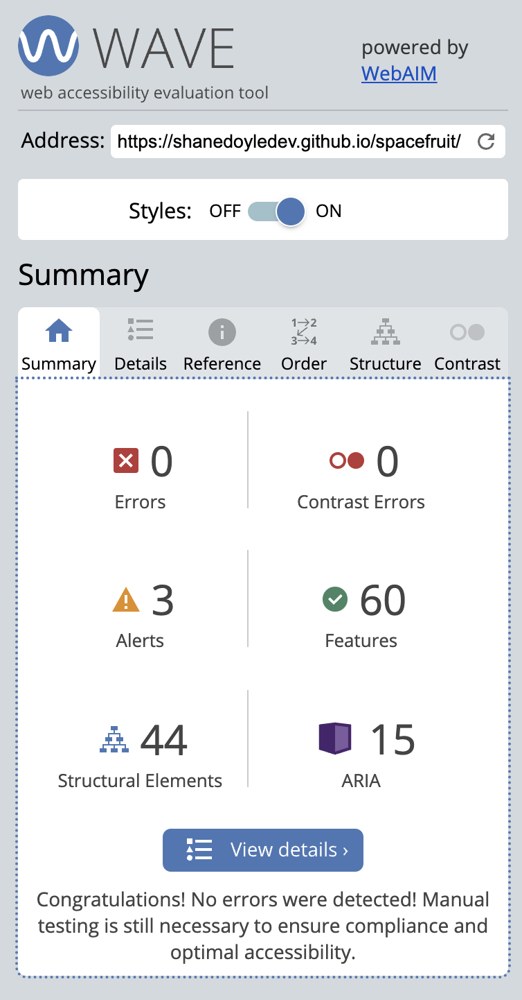

 

---

### Manual testing

#### User Stories Testing

`User Goals`
| User Goals | How are they achieved? |
| :------------------------------------------------------------------------------------ | :---------------------------------------------------------------------------------------- |
| I want to easily understand the services offered by the agency. | Services are prominently displayed below the hero section with detailed cards for each offering. |
| I want to navigate easily and find the content I'm looking for regardless of where I am on the page. | A sticky navigation bar appears after the hero, allowing quick access to any section and minimizing scrolling. |
| I want to see compelling examples of any previous campaigns the agency has worked on. | The portfolio section highlights top campaigns, each paired with a summary and relevant image. |
| I want to determine if the agency has collaborated with any notable brands before. | The brands section showcases logos of well-known collaborators, underlining the agency's expertise and authority. |
| I want to find client testimonials to gain insights into what their users think of them and assess their level of trustworthiness. | Testimonials are displayed in a neatly organized section, enabling easy switching between reviews. |
| I want to have a user-friendly way to message the agency and find their contact details, along with any social media links. | Contact buttons are in the navigation and call-to-action areas. Clicking displays a modal with a contact form, which, when submitted, will display a thank you message for the user. |

 

`Company Goals`
| Company Goals | How are they achieved? |
| :------------------------------------------------------------------------------------ | :---------------------------------------------------------------------------------------- |
| I want to make a positive impression on any potential clients in an effort to attract new business. | The services section below the hero section highlights offerings with detailed cards. |
| I want to showcase our best work to prove our capability and skill to potential clients. | The portfolio section displays the company's top campaigns with visuals and concise summaries. |
| I want to see compelling examples of any previous campaigns the agency has worked on. | The portfolio section emphasizes the best and recent campaigns with paired images and summaries. |
| I want to ensure the content and information presented on the site is relevant to serving the needs of the visitor. | Relevant content is organized into distinct sections, revealing the most important information about the agency that a client would need to know. |
| I want a strong CTA (Call to Action) to establish communication and build relationships with new clients. | A CTA at the page's end with compelling imagery and a large button encourages visitors to establish contact. |

### Full Testing

#### Devices

Below are the various devices and browsers I tested my website on after it was deployed.

- 24-inch Desktop Monitor
- 13-inch MacBook Pro
- 11 inch iPad Pro
- iPhone 13
- Samsung S10

#### Browsers

- Google Chrome
- Firefox
- Safari
- Edge
- Samsung Internet

 

`Navbar `
| Feature | Expected Outcome | Testing Performed | Result | Pass/Fail |
| --------------------------- | --------------------------------------------------------------------------------------------- | ------------------------------- | ----------------------------------------------------- | --------- |
| Navbar | Becomes sticky after scrolling past Hero section | Scroll past Hero section | Navbar becomes sticky | Pass ✅ |
| Navbar | Changes to colored background after scrolling past Hero section | Scroll past Hero section | Navbar changes to correct background color | Pass ✅ |
| Navbar Hamburger Icon | On mobile, elements disappear to reveal hamburger icon in the center | Resize viewport to mobile width | Hamburger appears and displays as intended | Pass ✅ |
| Navbar Hamburger Icon | When clicked the Mobile Nav menu dropdown slides into view | Click Icon | Mobile Nav menu dropdown slides into view as intended | Pass ✅ |
| Navbar Logo | Becomes visible when the navbar is sticky at desktop size | Make the navbar sticky by scrolling past Hero section on desktop size | Navbar logo becomes visible | Pass ✅ |
| Navbar Links | Should all be centered over the Hero image at the top of the page | Scroll to the top of the page | Menu links are displayed as intended | Pass ✅ |
| Navbar Links | Line transition should appear on hover | Hover over each navbar link | Hover transition plays correctly on hover | Pass ✅ |
| Navbar Links | When the navbar is sticky, menu items should right-align in the navbar | Scroll past the hero section | Menu links are positioned as intended | Pass ✅ |
| Navbar Link - Services | When clicked, you smooth scroll to the services section from both mobile and desktop menu | Clicked link | Correctly smooth scrolled to the services section | Pass ✅ |
| Navbar Link - Our Work | When clicked, you smooth scroll to the portfolio section from both mobile and desktop menu | Clicked link | Correctly smooth scrolled to the portfolio section | Pass ✅ |
| Navbar Link - Clients | When clicked, you smooth scroll to the clients' section from both mobile and desktop menu | Clicked link | Correctly smooth scrolled to the clients' section | Pass ✅ |
| Navbar Link - Testimonials | When clicked, you smooth scroll to the Testimonials section from both mobile and desktop menu | Clicked link | Correctly smooth scrolled to the Testimonials section | Pass ✅ |
| Navbar Link - Meet The Team | When clicked, you smooth scroll to the team section from both mobile and desktop menu | Clicked link | Correctly smooth scrolled to the Team section | Pass ✅ |
| Navbar Contact Us link | When clicked, you toggle open the form modal | Clicked link | Modal correctly displays | Pass ✅ |
| Navbar Contact Us link | Changes background colour on hover| Hover link | Transitions background color when hovered over | Pass ✅ |

 

`Hero Section`
| Feature | Expected Outcome | Testing Performed | Result | Pass/Fail |
| ----------------------- | ----------------------------------------------------------------- | ---------------------------- | ------------------------------------------------------------ | --------- |
| Hero Section Background | Background image covers and remains centered over all section widths | Window resize | Background image remains centered and covers all widths | Pass ✅ |
| Hero Section Background | Background image is shown | Load website | Background image correctly loads | Pass ✅ |
| Hero Section Logo | Maintains its center position on different window resizes | Window resize | Logo correctly maintains its position across different window resizes | Pass ✅ |

 

`Services Section`
| Feature | Expected Outcome | Testing Performed | Result | Pass/Fail |
| ------------------ | -------------------------------------------------------------------- | ----------------- | ------------------------------------------ | --------- |
| Services Section | Service cards display in row formation next to each other on desktop | Window resize | Service cards display as intended | Pass ✅ |
| Services Section | Service cards collapse to column formation on mobile | Window resize | Service cards display as intended | Pass ✅ |
| Service Card Icons | Icons correctly load upon opening the website | Open Website | Icon for each service card correctly loads | Pass ✅ |

 

`Portfolio Section`
| Feature | Expected Outcome | Testing Performed | Result | Pass/Fail |
| --------------------- | -------------------------------------------------------------------------------- | ----------------- | --------------------------------------------- | --------- |
| Portfolio Card | Image and text display next to each other on desktop sizes | Window resize | Image and text display as intended on desktop | Pass ✅ |
| Portfolio Card | Image and text switch orientation to have image stacked on top of text on mobile | Window resize | Image and text display as intended on mobile | Pass ✅ |
| Portfolio Card Images | Each card image loads correctly | Open website | Each card image loads correctly | Pass ✅ |

 

`Clients Section`
| Feature | Expected Outcome | Testing Performed | Result | Pass/Fail |
| --------------------- | ------------------------------------------------------------------- | ----------------- | ----------------------------------- | --------- |
| Clients Section | Logo icons display in a row formation next to each other on desktop | Window resize | Logo icon cards display as intended | Pass ✅ |
| Clients Section | Logo icons flex wrap as the window resizes to mobile | Window resize | Logo icons flex wrap as intended | Pass ✅ |
| Clients Section Logos | Logos load correctly upon opening the website | Open Website | Logos for each brand load correctly | Pass ✅ |

 

`Testimonials Section`
| Feature | Expected Outcome | Testing Performed | Result | Pass/Fail |
| --------------------------- | -------------------------------------------------- | ----------------- | ------------------------------------------------- | --------- |
| Testimonials section images | All images load successfully | Open website | All images load correctly | Pass ✅ |
| Testimonials Container | Profile image and header are displayed side by side| Resize website to desktop | Container is correctly laid out | Pass ✅ |
| Testimonials Container | Profile image and header are stacked in a column formation | Resize website to mobile | Container is correctly laid out | Pass ✅ |
| Dot grid decorative image | Image displays on desktop and disappears on mobile | Window resize | Image is removed and revealed as intended | Pass ✅ |
| L decorative image | Image displays on desktop and disappears on mobile | Window resize | Image is removed and revealed as intended | Pass ✅ |
| Quotation Icon | Icon displays on desktop and disappears on mobile | Window resize | Icon is removed and revealed as intended | Pass ✅ |
| Pagination left arrow | Testimonials revealed for each click | Clicked icon | Cycles back through each testimonial correctly | Pass ✅ |
| Pagination right arrow | Testimonials revealed for each click | Clicked icon | Cycles forward through each testimonial correctly | Pass ✅ |
| Pagination dot 1 | Shows first testimonial and becomes highlighted | Clicked icon | Correctly shows the first testimonial and becomes highlighted | Pass ✅ |
| Pagination dot 2 | Shows second testimonial and becomes highlighted | Clicked icon | Correctly shows the second testimonial and becomes highlighted | Pass ✅ |
| Pagination dot 3 | Shows third testimonial and becomes highlighted | Clicked icon | Correctly shows the third testimonial and becomes highlighted | Pass ✅ |
| Pagination dot 4 | Shows fourth testimonial and becomes highlighted | Clicked icon | Correctly shows the fourth testimonial and becomes highlighted | Pass ✅ |

 

`Team Section`
| Feature | Expected Outcome | Testing Performed | Result | Pass/Fail |
| ------------------------- | --------------------------------------------------------------------------------------------------------------- | ----------------- | ---------------------------- | --------- |
| Team section images | All images load successfully | Open website | All images load correctly | Pass ✅ |
| Team member profile cards | Cards show as a 3x3 grid on desktop and collapse to 2x2 and then single columns as the window resizes to mobile | Window resize | Cards reposition as intended | Pass ✅ |

 

`CTA Section`
| Feature | Expected Outcome | Testing Performed | Result | Pass/Fail |
| ---------------------------- | -------------------------------------- | ----------------- | -------------------------------------------- | --------- |
| CTA section images | Images load successfully | Open website | Images load correctly | Pass ✅ |
| CTA section background image | Background remains centered and covers | Window resize | Background image remains centered and covers | Pass ✅ |
| CTA Button | Click opens form modal | Clicked Button | Modal opens successfully | Pass ✅ |
| CTA Button | Hover changes button color | Hover Button | Button changes color on hover | Pass ✅ |

 

`Footer Section`
| Feature | Expected Outcome | Testing Performed | Result | Pass/Fail |
| ------------------ | ---------------------------- | ----------------- | --------------------------------------------- | --------- |
| Instagram Link | Click redirects to Instagram in a new browser tab | Clicked Link | Successfully redirected to Instagram homepage on a new browser tab | Pass ✅ |
| Facebook Link | Click redirects to Facebook in a new browser tab | Clicked Link | Successfully redirected to Facebook homepage on a new browser tab | Pass ✅ |
| LinkedIn Link | Click redirects to LinkedIn in a new browser tab | Clicked Link | Successfully redirected to LinkedIn homepage on a new browser tab | Pass ✅ |
| Twitter Link | Click redirects to Twitter in a new browser tab | Clicked Link | Successfully redirected to Twitter homepage on a new browser tab | Pass ✅ |
| YouTube Link | Click redirects to YouTube in a new browser tab | Clicked Link | Successfully redirected to YouTube homepage on a new browser tab | Pass ✅ |

 

`Modal Form`
| Feature | Expected Outcome | Testing Performed | Result | Pass/Fail |
| ---------------------------- | ------------------------------------------------------ | ----------------- | -------------------------------------------- | --------- |
| Form Modal | Display Image and Form Side by Side on Desktop Screens | Resize window | Modal: image and form positioned correctly | Pass ✅ |
| Form Modal | Display Image on Top of Form on Mobile Screens | Resize window | Modal: image and form positioned correctly | Pass ✅ |
| Image | Load Image when Modal is Opened | Open modal | Image loads correctly | Pass ✅ |
| Form Name Label | Focus on Name Input when Label is Clicked | Label clicked | Name input correctly focused | Pass ✅ |
| Form Name Input | Prevent Form Submission if Name Input is Empty | Submit form | Empty name input prevents form submission | Pass ✅ |
| Form Email Label | Focus on Email Input when Label is Clicked | Label clicked | Email input correctly focused | Pass ✅ |
| Form Email Input | Prevent Form Submission if Email Input is Empty | Submit form | Empty email input prevents form submission | Pass ✅ |
| Form Email Input | Prevent Form Submission if Invalid Email is Entered | Submit form | Invalid email input prevents form submission | Pass ✅ |
| Form Message Textbox Label | Focus on Message Textbox when Label is Clicked | Label clicked | Message Textbox input correctly focused | Pass ✅ |
| Form Message Textbox | Prevent Form Submission if no text is Entered | Submit form | Invalid email input prevents form submission | Pass ✅ |
| Form Submit Button | Successfully Submit the Form | Submit form | Form submits | Pass ✅ |
| Form Thank You Message | Display a Confirmation Message after Submission | Submit form | Message displayed correctly | Pass ✅ |
| Modal Close Icon | Close the Modal when Close Icon is Clicked | Clicked icon | Modal closes | Pass ✅ |

 

`404 Page`
| Feature | Expected Outcome | Testing Performed | Result | Pass/Fail |
| ------------------------- | ------------------------- | ------------------- | ---------------------------------- | --------- |
| 404 Page | Incorrect URL redirection | Enter incorrect URL | Successful redirection to 404 page | Pass ✅ |
| 404 Page background image | Image loads successfully | Open website | Images load correctly | Pass ✅ |
| 404 Page homepage link | Redirected to homepage | Clicked Link | Redirected back to homepage | Pass ✅ |

### Bugs

### Known Bugs

1. **Missing Images on Deployment**

   ### 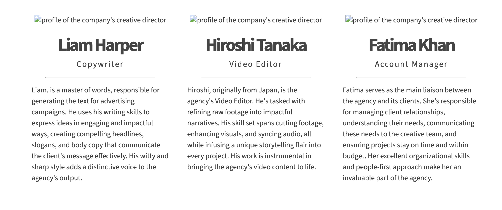

After deploying my website to Github pages, I noticed that some of my images weren't displayed, even though they appeared correctly on my local machine.

 

2. **Flashing Animations on Window Resize**

 

Resizing the browser window caused certain elements on the webpage, like the navbar, to flash and jump around.

---

### Solved Bugs

1. **Missing images on deployment (Solved)**

   ### 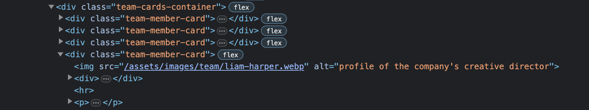

Upon inspecting my image links, I noticed that a few began with a "/" making them absolute links. Removing the forward slash converted them into relative links, allowing the images to be displayed correctly when the site was deployed.

 

2. **Flashing animations on window resize (Solved)**

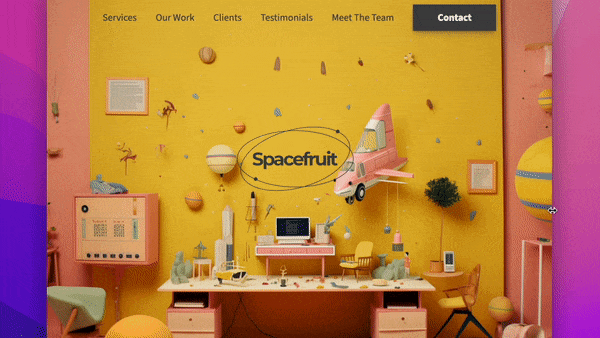

 

After researching the issue, I discovered that the problem was caused by media queries altering the properties of certain elements at specific breakpoints. The transition property caused these changes to be animated, leading to the flashing and erratic movement on screen.

I resolved this by referencing an [article from CSS-Tricks](https://css-tricks.com/stop-animations-during-window-resizing/) which addresses this issue. The article recommended using JavaScript to temporarily disable transition animations during a window resize event, effectively fixing the problem.

 

## Credits

### Code Used And Tutorials

- [Create a Design System with CSS](https://www.youtube.com/watch?v=lRaL-8qZ0mM&t=3178s) - This course by Kevin Powell introduced the "reduced motion" CSS snippet. It not only enhanced my website's accessibility but also influenced the planning of my website's design system.

- [CSS Tricks: Stop Animations During Window Resizing](https://css-tricks.com/stop-animations-during-window-resizing/) - I utilized the JavaScript code snippet from this article to temporarily halt transition animations while resizing the window. This was crucial in resolving a glitch where elements would sporadically flash and shift during viewport resizing.

- [Build and deploy a portfolio website](https://www.youtube.com/watch?v=_xkSvufmjEs) - Some of the code for the interactive mobile navigation used on this website was taken from a portfolio website tutorial by Kevin Powell. It was then readapted and customized for my own project.

- [Jonas Schmedtmann's Udemy Course](https://www.udemy.com/course/the-complete-javascript-course/) - The chapter on DOM manipulation from this excellent course gave me the knowledge needed to impliment the JavaScript code for creating the sticky navigation and also how to implement the interactive testimonial section of my website.

- [Colt Steele's Git And GitHub Course](https://www.udemy.com/course/git-and-github-bootcamp/) - As my project grew, maintaining a clean git history became vital. The interactive rebase chapter of the course was useful in helping me refactor prior commits, ensuring the long-term manageability of my project.

### Content

Some of the text content on the website was written by me, while some were generated by ChatGPT, which I then edited and refined. ChatGPT was also used to help check for any potential spelling or grammatical errors in the text.

### Media

- [Flaticon](https://www.flaticon.com/free-icons/saturn) - Where I sourced my favicon.
- [Thin Glyphs Icon Set](https://www.figma.com/community/file/1003754713433918928) - Many of the website SVG icons were sourced from this Figma Icon Set.
- [Retturoo: Hand Drawn Retro Shapes](https://www.figma.com/community/file/1163470945933586849) - A selection of shapes from this Figma collection was used for the website's decorative elements.
- [Brandfetch](https://www.figma.com/community/plugin/733590967040604714/Brandfetch) - All of the Brand Logo SVGs were generated from this Figma plugin.
- [User Profile](https://www.figma.com/community/plugin/749945157855564842/User-Profile) - This Figma plugin allowed me to generate profile avatars for each of the personas in the testimonial section.
- [Midjourney](https://www.midjourney.com/) - All images were generated with the usage of Midjourney v5.2.

### Acknowledgments

- My Mentor [Lauren-Nicole](https://github.com/CluelessBiker) - who offered excellent advice, provided solid feedback, and supported me during my work on this project.

- My Cohort Facilitator [Iris Smok](https://github.com/Iris-Smok) - for being helpful and supportive to me and all of my class members during the course.

- The Code Institute community - to both my class and the community in general. Having access to a wonderful community of people who are as passionate about coding as I am has greatly aided my coding journey so far.

- To you, dear reader, for taking the time to read my documentation. Have a cookie! 🍪

 

[Back to Top ^](#introduction)
